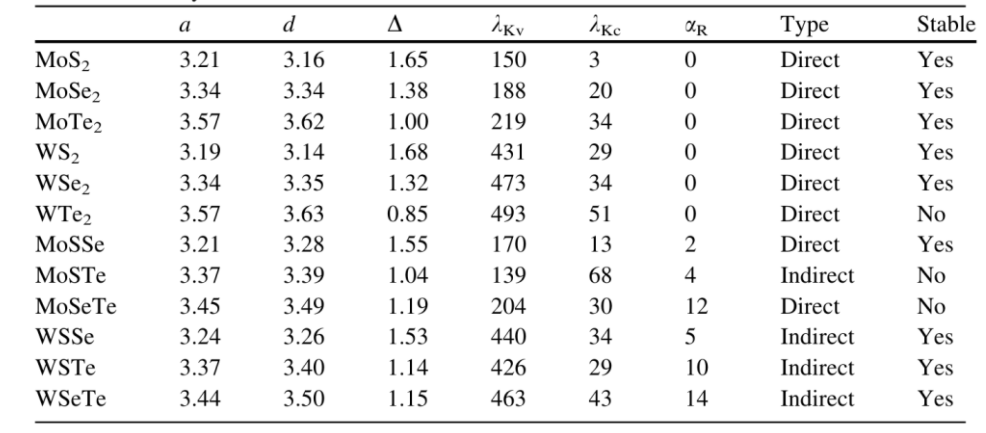
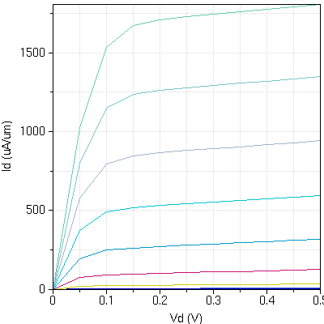
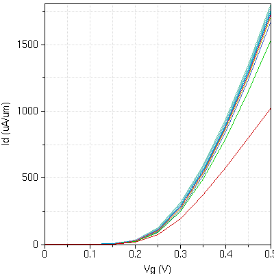
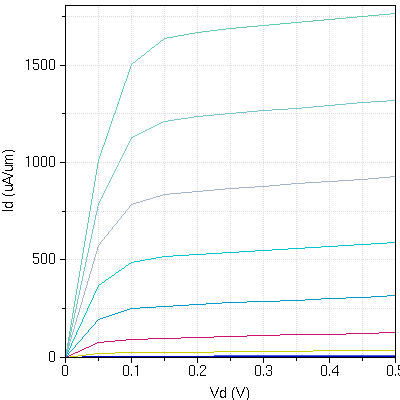
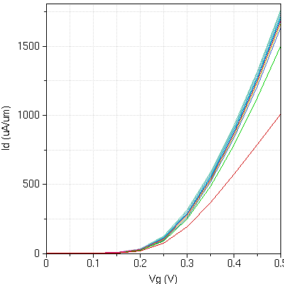
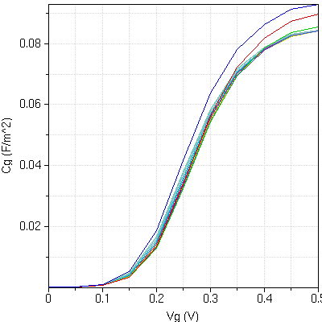

## 
探究场效应晶体管漏极电流与栅极电压、漏极电压以及材质之间的关系

 姓名：高立科  学号：2018053307 日期：2021.3.30 地点：N129

### 1. 实验目的
利用仿真软件，探究场效应晶体管漏极电流与栅极电压、漏极电压，以及材质之间的关系；
以及漏极电流受上述三个参数的影响程度的大小。
### 2. 实验原理 
- 场效应管工作原理
场效应晶体管（Field Effect Transistor缩写(FET)）简称场效应管。主要有两种类型（junction FET—JFET)和金属 - 氧化物半导体场效应管（metal-oxide semiconductor FET，简称MOS-FET）。由多数载流子参与导电，也称为单极型晶体管。它属于电压控制型半导体器件。
在过渡层由于没有电子、空穴的自由移动，在理想状态下几乎具有绝缘特性，通常电流也难流动。但是此时漏极-源极间的电场，实际上是两个过渡层接触漏极与门极下部附近，由于漂移电场拉去的高速电子通过过渡层。因漂移电场的强度几乎不变产生ID的饱和现象。
电路将一个增强型P沟道MOS场效应管和一个增强型N沟道MOS场效应管组合在一起使用。当输入端为低电平时，P沟道MOS场效应管导通，输出端与电源正极接通。当输入端为高电平时，N沟道MOS场效应管导通，输出端与电源地接通。在该电路中，P沟道MOS场效应管和N沟道MOS场效应管总是在相反的状态下工作，其相位输入端和输出端相反。
- 各参数解释
    * Channel Material(通道材料)：其常见二维材料有MoS2,MoSe2,MoTe2以及WS2。这些材料的区别与关系如下图。
      
    其中α表示结构参数中的表面积，d表示结构参数中的厚度；Δ表示带隙，具有自旋-轨道耦合，自旋分裂为K点的 $\lambda_{kv}$的最高价带，自旋分裂为最低导带k点$\lambda_{kc}$,在$\alpha_R$点的最高价带，以及带自旋轨道耦合的带隙类型（直接或间接）和平面二维结构的稳定性。
    * CMOS Type:分为n型和p型半导体。
- 2DFET
2DFET是用于二维(2D)FET的数值模拟器。
可以对包括MoS2，MoSe2，MoTe2,ws2和Black Phorsphorene(BP)在内的各种单层2D材料的n型和p型沟道FET进行仿真。可以评估在弹道极限和散射状态下的晶体管特性。
### 3. 实验方案设计
将材料设置为MoS2,n型结型场效应管，设置为存在弹道极限，其他参数不变。在该情况下，利用仿真软件进行仿真，观察并分析电流-电压曲线，探究漏极电流受上述三个参数的影响程度。
### 4. 实验结果分析
当Vd与Vg变化时，Id所对应的值如下图所示。
  
可以看出，当Vg=0时，2DFET处于截止状态，不存在导电的沟道，不论Vd是否为0，为何值，Id均等于0。
在Vg大于一定程度后，Id-Vd的图像形状由Vd的值起主导作用。观察发现，在Vd为Vg的一定倍数值后，Id电流曲线由快速增加趋于平缓，后续区域称为放大区。
不同Vg下Id随Vd变化情况如下表。
<table>
   <tr>
      <td>Id(uA/um)</td>
      <td></td>
      <td>Vg(V)</td>
      <td></td>
      <td></td>
   </tr>
   <tr>
      <td></td>
      <td></td>
      <td>0.2</td>
      <td>0.25</td>
      <td>0.3</td>
   </tr>
   <tr>
      <td>Vd(V)</td>
      <td>0</td>
      <td>0</td>
      <td>0</td>
      <td>0</td>
   </tr>
   <tr>
      <td></td>
      <td>17.849</td>
      <td>0.05</td>
      <td>0.05</td>
      <td>194.148</td>
   </tr>
   <tr>
      <td></td>
      <td>21.7745</td>
      <td>0.1</td>
      <td>0.1</td>
      <td>247.182</td>
   </tr>
   <tr>
      <td></td>
      <td>23.4074</td>
      <td>0.15</td>
      <td>0.15</td>
      <td>262.057</td>
   </tr>
   <tr>
      <td></td>
      <td>24.7323</td>
      <td>0.2</td>
      <td>0.2</td>
      <td>270.518</td>
   </tr>
   <tr>
      <td></td>
      <td>26.061</td>
      <td>0.25</td>
      <td>0.25</td>
      <td>278.082</td>
   </tr>
   <tr>
      <td></td>
      <td>27.4431</td>
      <td>0.3</td>
      <td>0.3</td>
      <td>285.596</td>
   </tr>
   <tr>
      <td></td>
      <td>28.8883</td>
      <td>0.35</td>
      <td>0.35</td>
      <td>293.187</td>
   </tr>
   <tr>
      <td></td>
      <td>30.3998</td>
      <td>0.4</td>
      <td>0.4</td>
      <td>300.873</td>
   </tr>
   <tr>
      <td></td>
      <td>31.98</td>
      <td>0.45</td>
      <td>0.45</td>
      <td>308.658</td>
   </tr>
   <tr>
      <td></td>
      <td>33.631</td>
      <td>0.5</td>
      <td>0.5</td>
      <td>316.539</td>
   </tr>
   <tr>
      <td></td>
   </tr>
</table>
可以看出，当Vd>0.1V后，Id增长趋于平缓，进入放大区，0.1V约为该2DFET的夹断电压。

ID-Vg图像如下图。
  
观察得知，Id与Vg关系大致呈指数关系，当栅极电压Vg小于开启电压Vgth时，漏极电流为0。
不同Vd下Id随Vg的变化如下表所示。

<table>
   <tr>
      <td>Id(uA/um)</td>
      <td></td>
      <td>Vd(V)</td>
      <td></td>
      <td></td>
   </tr>
   <tr>
      <td></td>
      <td></td>
      <td>0.1</td>
      <td>0.15</td>
      <td>0.2</td>
   </tr>
   <tr>
      <td>Vg(V)</td>
      <td>0</td>
      <td>0.0231</td>
      <td>0.0249027</td>
      <td>0.0264565</td>
   </tr>
   <tr>
      <td></td>
      <td>0.05</td>
      <td>0.1311</td>
      <td>0.141449</td>
      <td>0.15027</td>
   </tr>
   <tr>
      <td></td>
      <td>0.1</td>
      <td>0.7429</td>
      <td>0.801575</td>
      <td>0.851428</td>
   </tr>
   <tr>
      <td></td>
      <td>0.15</td>
      <td>4.1528</td>
      <td>4.48329</td>
      <td>4.75785</td>
   </tr>
   <tr>
      <td></td>
      <td>0.2</td>
      <td>21.7745</td>
      <td>23.4074</td>
      <td>24.7323</td>
   </tr>
   <tr>
      <td></td>
      <td>0.25</td>
      <td>89.5004</td>
      <td>95.4857</td>
      <td>99.7537</td>
   </tr>
   <tr>
      <td></td>
      <td>0.3</td>
      <td>247.182</td>
      <td>262.057</td>
      <td>270.518</td>
   </tr>
   <tr>
      <td></td>
      <td>0.35</td>
      <td>489.962</td>
      <td>519.3</td>
      <td>532.272</td>
   </tr>
   <tr>
      <td></td>
      <td>0.4</td>
      <td>795.79</td>
      <td>847.953</td>
      <td>866.406</td>
   </tr>
   <tr>
      <td></td>
      <td>0.45</td>
      <td>1148.65</td>
      <td>1235.98</td>
      <td>1261.88</td>
   </tr>
   <tr>
      <td></td>
      <td>0.5</td>
      <td>1534.39</td>
      <td>1674.01</td>
      <td>1710.61</td>
   </tr>
   <tr>
      <td></td>
   </tr>
</table>

当Vg超过一定程度后，漏极电流显著增大。因此，开启电压Vgth约为0.15v。

同理，在不同的二维材料作用下(如MoTe2)，Id-Vd图像与Id-Vg图像的变化如下图。
下图为MoTe2材料下Id-Vd的图像。
  
下图为MoTe2材料下的Id-Vg图像。
  
可见相比于MoS2材料，下图为MoTe2材料下Id随Vd变化更陡峭，Id随Vg变化线条更为密集，但是总体来说，变化相较于MoS2材料不是很大。
MoS2的Cg-Vg变化情况如下图。
  
可以发现，Cg-Vg函数图像存在拐点，其拐点处导数最大，也即在Vg≈0.3V的时候，Cg变化速率最大。因此可以认为，Vgs≈0.3V。
### 5. 实验结论：
漏极电流Id与栅极电压Vg、漏极电压Vd，存在一定的函数关系；其中Vg存在一个开启电压Vgth，在低于Vgth的限度后，不论Vd取何值，Id均为0；Vd存在一个夹断电压，当Vd大于夹断电压的限度后，Id电流值趋于平缓，其值几乎只取决于Vg的值。
漏极电流Id受二维材料的影响不大。
同时查找文献发现，虽然Id受二维平面材料影响不大，但是不同平面材料之间参数差异巨大，这些材料统称为TMD(过渡金属二硫属化合物)。
TMD由于其极大化的静电效率、机械强度、可调电子结构等优异性质，开始被考虑用于电子、光子、感测、能源元件等领域。
与此同时，$MoS_2$的漏电流远较硅小几个数量级，二硫化钼的电子迁移速率大约是100cm2/vs（即每平方厘米每伏秒通过100个电子），这远低于晶体硅的电子迁移速率1400 cm2/vs，但是比非晶硅和其他超薄半导体的迁移速度更好，因此功耗也很小。同时，$MoS_2$还是直接带隙半导体，在未来5nm以下制程的半导体中首先被考虑。
### 6. 实验心得：
通过本次仿真实验，我更加理解了2DFET的工作原理，对二维平面材料的各个优缺点有了更加深刻的认识。通过控制变量法，提取出了漏极电流受Vg、Vd的变化程度，加深了我对三极管的印象与理解。
