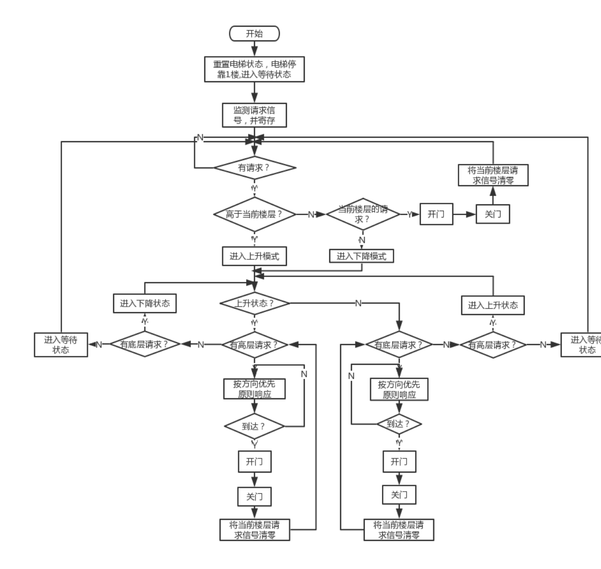

### 1、题目
用VHDL设计电梯控制器
### 2、设计要求
* 5层电梯控制器，用5个led显示电梯行进过程，并用数码管显示电梯当前所在楼层位置，每层电梯入口处设有上楼和下楼请求按钮，按下按钮，则相应楼层的led亮
* 电梯到达请求楼层，相应的请求led灯灭，电梯门打开，开门ss，电梯自动关门，继续上行（下行）
* 每层设有电梯上行和下行指示灯
* 能记忆电梯内部的请求信号
### 3、小组任务
崔然:检测信号处理请求模块
高立科:逻辑处理模块
聂婷:数码管显示模块

<!-- 流程图如下。
   -->

### 4、文档编写
文档编写由小组成员共同完成。
