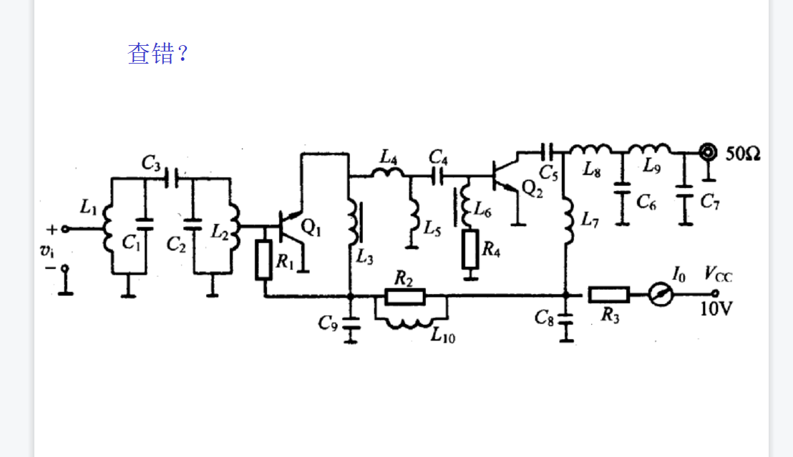

### 第一章
BC
主观题:

### 第二章
1、接收机由高放、混频和中放组成。已知高放的噪声系数为4，增益为10dB，混频器的噪声系数为7，功率传输系数为0.2, 中放的噪声系数为3，功率增益105。现用一个10m长，衰减量为0.3dB/m的高频电缆将接收机连至天线，画出系统框图，求总的噪声系数。电缆按无源器件计算。

  

$F=F_1+$
  

### 第78章
最小输出频率是频率间隔
$f_s/M=f_r$相乘就减10
$(f_0-f_l)/n=f_r$
输出频率间隔$f_r一定是0.1MHz$

### 第十章
  

**1-2**:$L+\frac{1}{w^2_0C}$,根据已知w和C,求得L;
$Q_0=\frac{f_0}{BW_{3dB}}$,根据已知$f_0$和通频带,求得$Q_0$
于是$S=\frac{1}{\sqrt{1+(Q_0\frac{2(f-f_0)}{f})^2}}$求得信号选择性S。
(2):当通频带等于300kHz时,$Q_e=\frac{f_0}{BW_{3dB}}$,回路谐振电导$G_e=\frac{1}{\rho Q_e}=\frac{w_0C}{Q_e}$,回路空载谐振电导$G_0=\frac{w_0C}{Q_0}$,所以并联电导$G=G_e-G_0$,并联电阻$R=\frac{1}{G}$

**1-5**由于回路为高Q,所以回路谐振频率
$$f_0\approx\frac{1}{2\pi\sqrt{LC}}$$
回路的损耗电阻
$$r=\frac{w_0L}{Q_0}$$
回路的谐振阻抗
$$
R_p=r(1+Q_0^2)
$$
考虑信号源内阻及负载后回路的总谐振阻抗为
$$
R_{\sum}=R_S||R_P||R_L
$$
  
1. 晶体管Q1的极性反了
2. Q1集电极电源被L4、L5短路
3. Q2基极电阻R4两端应并大电容以防止R4分压输入信号
4. Q2集电极电源被C5隔断没有加上。

$\phi$