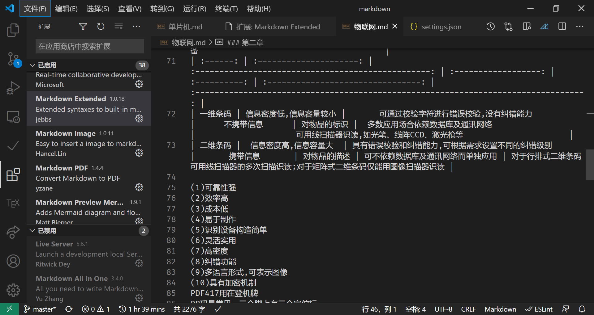

### 第一章
物联网的定义(名词解释)
- 物联网是"物与物相联的互联网"
物联网的技术特征
- 全面感知、互通互联、智慧运行
物联网与各种网络的关系(简答题全部都在作业里考)
- 物联网与互联网的关系
    - 互联网是由多个计算机网络按照一定的协议组成的国际计算机网络。
- 物联网与传感网的关系
    - 传感网定义为随机分布的集成有传感器、数据处理单元、和通信单元的微小节点,通过自组织的形式构成的无线网络。
- 物联网与泛在网的关系
    - 泛在网:广泛存在的网络,基本特征为无所不在、无所不包、无所不能
- 物联网与CPS
    - CPS:信息物理系统是一个综合计算、网络和物理环境的多维复杂系统。
物联网发展历史(谁前谁后)
- 1995年,比尔盖茨出版<未来之路>。
- 1999年,美国麻省理工学院研究RFID提出了物联网概念的雏形
- 2005年11月,国际电信联盟发布了XXX,正式提出了物联网的概念。
- 2009年IBM公司提出智慧地球的概念。

物联网的应用背景(选择题，判断题)
- 智能运输、智能建筑、数字化医疗、摇杆勘测、环境保护、消防、军事、煤炭、金融、水务、林业、电力、农业、气象、石化、供应链、移动POS、工业自动化、公共安全
物联网三层模型(层，层，层)
- 感知层、网络层、应用层
协议体系的五层模型
- 物理层、数据链路层、网络层、运输层、应用层

### 第二章

物品分类(条码编码体系和电子编码EPC体系)(考主流缩写)
- EAN.UCC编码体系:简称EAN,是一个国际性的非官方的非营利性组织;UCC是一家致力于全球贸易标准化的非营利组织系统
- GTIN(Global Trade Item Number)是为全球贸易项目提供唯一标识的一种代码
- SSCC代码,系列货运包装箱代码,是为物流单元(运输和/或储藏)提供唯一标识的代码
- GLN代码(Global Location Number)又称全球位置码,是对参与供应链等活动的法律实体、功能实体和物理实体进行唯一标识的代码
- GRAI代码
全球可回收资产标识(Global Recyclabel Assets Identification),是对可回收资产进行标识的代码
全球单个资产标识
- GSRN代码:全球服务关系标识,是对服务关系中的接受服务者进行标识,他为服务提供方提供了一个准确唯一的表示代码,用以存储与提供给服务接收方的服务有关的数据。
- GDSN:通过GTIN+GLN实现数据接入。
条码读取的特点
- 
标识代码
电子码
EPC编码规则
- 唯一性、简单性、可扩展性、保密性与安全性

### 第三章
自动识别技术
- 自动识别技术是应用一定的识别装置,通过被识别物品和识别装置之间的接近活动,自动获取,自动识读被识别物品的相关信息,并提供给后台的计算机处理系统来未完成后续相关数据处理的一种技术。
自动识别技术的组成
- 自动识别系统因应用不同其组成会有所不同,但基本都是由标签、读写器和计算机网络这三大部分组成。
标签的形式很多,例如可以是条码或电子标签。
读写器是读写标签信息的设备。
自动识别技术的分类(选择题)
- 数据采集技术:光是别、磁识别、电识别等。
- 特征提取技术:静态特征识别、动态特征识别、属性特征识别等。
条码识别(重要)码制，条码构成
码制:EAN码、UPC码、UCC/EAN-128码、交叉25条码、39条码、93条码\库德巴条码等。
条码构成:空白区、起始符、数据符、校验符、终止符
校验码(通过加减乘除看是否与最后一位匹配)
首先，把条形码从右往左依次编序号为“1,2,3,4……”从序
号二开始把所有奇数序号位上的数相加求和，用求出的和乘3，
再把所有偶数序号上的数相加求和，用求出的和加上刚才奇数
序号上的数的和乘3的积，然后得出和。再用大于或等于这个和
的最小的10的倍数减去这个和，就得出校验码。
条码下有字符和字母为EAN25\39\35码

条码阅读器(常识)
二维码的特点
| 条码类型 |   信息密度与信息容量    |                 错误校验及纠正能力                  | 垂直方向是否携带信息 |     用途     |      对数据库和通讯网络的依赖      |                                      识读设备                                       |
| :------: | :---------------------: | :-------------------------------------------------: | :------------------: | :----------: | :--------------------------------: | :---------------------------------------------------------------------------------: |
| 一维条码 | 信息密度低,信息容量较小 |       可通过校验字符进行错误校验,没有纠错能力       |      不携带信息      | 对物品的标识 |  多数应用场合依赖数据库及通讯网络  |                     可用线扫描器识读,如光笔、线阵CCD、激光枪等                      |
| 二维条码 |  信息密度高,信息容量大  | 具有错误校验和纠错能力,可根据需求设置不同的纠错级别 |       携带信息       | 对物品的描述 | 可不依赖数据库及通讯网络而单独应用 | 对于行排式二维条码可用线扫描器的多次扫描识读;对于矩阵式二维条码仅能用图像扫描器识读 |
  

(1)可靠性强
(2)效率高
(3)成本低
(4)易于制作
(5)识别设备构造简单
(6)灵活实用
(7)高密度
(8)纠错功能
(9)多语言形式,可表示图像
(10)具有加密机制
PDF417用在登机牌
QR码最常见，三个脚上有三个定位标
了解PDF417和QR谁读的快谁读的慢，谁信息量大

### 第四章
RFID的分类(高频超高频、识别距离)
按可编程划分:只读型(无线写入和有线写入)
安全性:只读型>有线写入>无线写入
抗金属电子标签
RFID的工作频率
OCR光学字符识别
热敏电阻种类
力敏传感器
光电倍增管用于宇宙射线探测
光敏电池
光敏电池必考
### 第五章 嵌入式系统
无线传感网络的定义
路由协议
工作方式有何不同
HFC接入是混合式接入
标红的地方是重点
分析高低
什么是光伏效应
解释其产生机制

### 第一章
物联网的定义(名词解释)(P6)
物联网的技术特征(P8)

物联网与各种网络的关系(简答题全部都在作业里考)()
物联网发展历史(谁前谁后)()

物联网的应用背景(选择题，判断题)
物联网三层模型(层，层，层)
协议体系的五层模型
第二章：
1.两个体系区分，各种主要缩写要记
2.条码读取的特点
3.编码体系六种代码（重要）
4.EPC编码结构（四个）
5.六种代码，对应关系？（电子码没有校验码）
第三章：
1.自动识别技术定义，组成部分，分类
2.条码识别（非常重要），码制，条码构成与作用，校验码如何工作（原理）
3.EAN-13码，8码，39码（可以有字符，有宽有窄，不止两种），25码，交叉25码（两种宽度）
4.条码阅读器工作原理（理解就好）
5.二维码特点，优势和局限，两种类型，PDF417码，QR码（常见），两种码的比较
6.二维码怎么识别（非常重要）
7.RFID射频识别的分类，构成，（电子标签，读写器，应用系统，了解）
8.RFID数据传输那个表格（要熟记），防碰撞机制
9.NFC特点，与其他的比较（能区别，具体数字不要求）
10.卡识别（不是很重点，了解），IC卡分类（非/接触式，复合卡，区别）
11.OCR是啥，了解了解
12.指纹识别，虹膜识别（了解一下），不同识别善于比较（那个表格）
第四章：
1.传感器一些名词的定义（了解），准确度、精密度、精度之间的关系
2.温敏传感器（热电偶无源、热电阻有源），要区分有源无源，热敏电阻分类（有缩写！），电阻特征
3.力敏传感器（电阻应变式有源，压电式无源）
4.光敏传感器（内光电效应分类，外光电效应：应用于宇宙射线探测）
5.作业：参考资料写作业
6.湿度，气体传感器（了解）
第五章：
1.嵌入式系统定义，名词解释
2.嵌入式系统结构（四个层面），特点，几种处理器分类及特点，嵌入式系统分类及特点，
第六章：
1.有线，无线传感器网络特点
2.无线传感网络（有缩写）的定义，体系结构，通信协议，MAC协议类型及区别，路由协议，两种传输协议区别,zigbee和zwave区别
第七章：
1.有线接入技术五种（有缩写），无线接入，HFC掌握，5G特点（掌握！！），5G网络特点（五边形，要弄明白！！！）